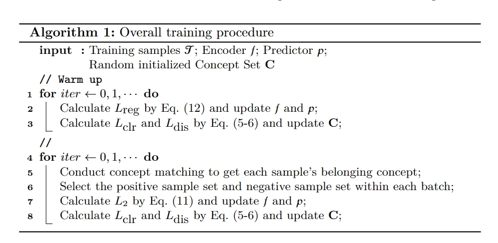
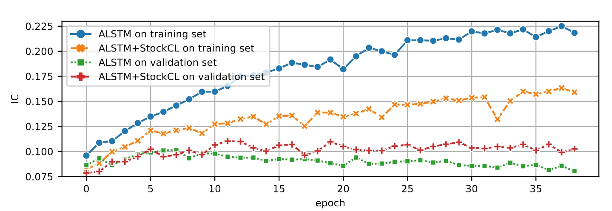

# StockCL
This is the depository for StockCL: Selective Contrastive Learning for Stock Trend Forecasting via Learnable Concepts, DASFAA 2024. 

The code will be available soon as the code is currently being organized.

### Appendix

#### A. Overall training procedure of StockCL.

#### B. Complexity Analysis.
The time complexity of the concept pool component is $\mathcal{O}(MN)$ and the time complexity of the concept-aware contrastive pair selector component is $\mathcal{O}(Nb)$, where $b$ is the batch size, $M$ is the concept pool size and $N$ is the total sample number. It is practically efficient since $M$ and $b$ are much smaller than $N$ and all of the operations are done inside batches. Additional parameters are only the concept representations, which is negligible compared with the parameters in the deep encoder. 

#### C. Implementation Details.
**Evaluation Metrics**. Stock trend forecasting is mainly used in quantitative investment for the ranking of each stock in term of their future daily return. Hence, we use the four popular ranking based evaluation metrics: IC, ICIR, Rank IC and Rank ICIR. At each date $t$, we evaluate the relationship of prediction result and the ground truth change rate:
$$
IC^{(t)}=\frac{1}{N} \frac{\left(\hat{\mathbf{y}}^{(t)}-\operatorname{mean}\left(\hat{\mathbf{y}}^{(t)}\right)\right)^{\top}\left(\mathbf{y}^{(t)}-\operatorname{mean}\left(\mathbf{y}^{(t)}\right)\right)}{\operatorname{std}\left(\hat{\mathbf{y}}^{(t)}\right) \cdot \operatorname{std}\left(\mathbf{y}^{(t)}\right)}
$$
where $\mathbf{y}^{(t)}$ represents the ground truth labels of all the samples at time $t$ and $\hat{\mathbf{y}}^{(t)}$ represents the predicted values of the corresponding samples. IC is defined as the average of $\{IC^{(t)}\}$ across all the days in the test set. ICIR is calculated by dividing IC by the standard deviation of $\{IC^{(t)}\}$. IC represents the consistence between the prediction and the labels and ICIR represents the consistence excluding the impact of fluctuations across the days. Rank IC and Rank ICIR are similar, but $\mathbf{y}^{(t)}$ and $\hat{\mathbf{y}}^{(t)}$ in the definition are replaced by the normalized ranks of ground truth labels and predictions. For all the four metrics, a higher value reflects better performance.  

**Experiment Setup** We use PyTorch to develop StockCL and the stock trend forecasting models. All experiments are run on an NVIDIA RTX2080Ti GPU. The dimension $d$ is set to 64. The threshold of choosing positive or negative samples, $\epsilon^{pos}$ and $\epsilon^{neg}$ are set to 0.2, 0.3. The number of concepts $M$ is set to 256. The margin $\delta$ in concept loss is set to $0.001$. The temperature coefficient $\tau$ is set to 0.1 and the contrastive loss weight $\lambda$ is set to 0.2. The batch size is set to 256 (2048 for Localformer) and the learning rate is set to $0.001$. The predictor is implemented as one fully-connected layer with an activation layer. The other hyper parameters of the stock trend forecasting models, including the number of layers, the dropout rate, etc, keep the same as Qlib benchmark. 

#### D. Training curve. 

Training curves on CSI500 dataset using ALSTM as stock trend forecasting model.

To understand how StockCL helps overcome the overfitting issue and improve the forecasting model's generalization ability, we draw the training curves of ALSTM on CSI500 as an example, as shown above. Without StockCL, the validation performance drops obviously after the $7th$ epoch while model's performance on training set keeps increasing. Without additional supervision signals, the limited but complex training stock data makes the model overfit on the training data too early, limiting the model's generalization ability. With StockCL, however, the validation performance reaches the peak on the $11th$ and the following performance does not drop significantly. With additional supervision signals from contrastive learning, the model can better learn the generic data distribution rather than simply memorizing the training samples. In this sense, with StockCL, the model performance on training set drops compared with the forecasting model itself, while the performance on the validation set gets higher and more stable. 